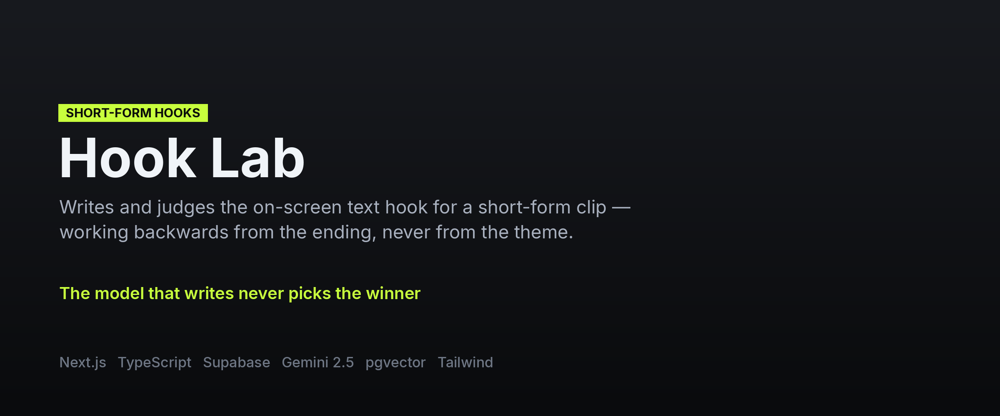
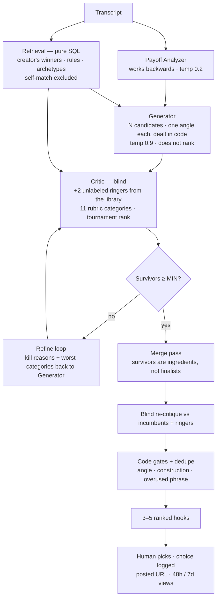

**[← All systems](https://github.com/musabqazi)** · [Caption Lab](https://github.com/musabqazi/caption-lab) · [Cavello Lab](https://github.com/musabqazi/cavello-lab) · [Portfolio](https://github.com/musabqazi/portfolio)

# Hook Lab

**Writes and judges the on-screen text hook for a short-form clip — working backwards from the ending, never from the theme.**

🟢 **In production** · **Client:** content agency (anonymised) · **Source:** private, available on request

## The problem

A hook has exactly one job: open a loop that **only the ending of the clip closes**. "Stop Being Hard On Yourself" describes the topic and dies. "Why My Mom Freaked Out When I Made Good Money" withholds something specific and works.

Ask a model for hooks and you get the first kind. It reads the transcript, finds the theme, and summarises it — because summarising is what it is good at. Ask the same model to pick its own best hook and it picks the one that reads most like a model wrote it.

## What I built

- **Backwards from the payoff.** A Payoff Analyzer reads the whole transcript and returns *every* payoff ranked by how much curiosity it would create if teased and not revealed — plus who the clip is for, what not knowing costs them, every number, timeframe and name in it, and the one thing that must stay secret.
- **Generation and judging are separate agents.** The Generator writes candidates at temperature 0.9, each dealt a different angle *in code* — negative, financial, transformation, contradiction, identity and eight more — so a batch explores genuinely different approaches instead of rewording one idea. It never ranks.
- **The Critic is blind and sees ringers.** It gets the candidates plus **two real winning hooks from the library, inserted unlabeled**, on a stronger model. It applies the kill rule, scores eleven rubric categories and tournament-ranks. Whether a candidate beat both ringers is recorded. Code gates then apply over the top — the model never has the last word.
- **A written standard compiled into the code.** The Text Hook Master Guide lives in `lib/hook-guide/`. It cannot be switched off, and every part a machine can check is checked in code rather than asked of a model.
- **A merge pass that has to win.** Survivors are treated as ingredients, not finalists: the Merger builds new hooks from their best parts, and what it returns goes back into a blind critique against the incumbents and the ringers. It is not promoted for free.
- **Retrieval that cannot cheat.** Hooks whose transcript matches the clip being worked on are excluded, so the system can never be handed its own answer.
- **A human makes the final pick.** The system ranks, the editor chooses, the choice is logged with the posted URL and 48-hour and 7-day view counts.

## Architecture

## Timing

Measured on the sample clip: analyze 11s → generate 14s → judge 53s → merge 7s → re-judge 37s. About **two minutes** end to end. The guide costs wall-clock time and that is the trade the design accepts — the judging step is the most expensive one and the one that decides quality.

## Stack

Every agent call sets `responseMimeType: "application/json"` with a `responseSchema`, so the JSON contract is enforced by the API itself — then parsed defensively and retried anyway.

## Pages

| Page | Purpose |
| --- | --- |
| **Generate** | Creator → transcript (paste, document or PDF) → ranked cards → Use This Hook |
| **Library** | Every hook that ran, with filters, single add, and bulk import with suggested archetypes |
| **Rules** | Global rules, per-creator rules, banned patterns — toggle any off, applies next run |
| **History** | Every run: transcript in, every round out, the tweaks between, what shipped, and the view counts |
| **Eval** | Runs the golden set — the real hook beside the system's pick, with blind mode and export |

## My role

Everything: encoding the written standard as code, the agent chain, the gate layer, the retrieval design, the eval harness, the UI and the deployment.

## Outcomes

- Hook writing moved from an editor's judgement call to a ranked shortlist with the reasoning attached — the editor still decides, but starts from five defensible options instead of a blank box.
- The ringer mechanism means quality is measured, not asserted: every run records whether the system's own output beat real winning hooks it could not identify.
- Rules are editable by the team in the UI rather than living in a prompt only I can change.

## A note on what you can see here

The evaluation corpus is real creator transcripts and is **not published** — the repo ships a synthetic fixture and a README describing the expected shape instead. Screenshots are not included because the app sits behind a team access token; happy to demo it live.

---
Part of the <a href="https://github.com/musabqazi">musabqazi portfolio</a> — real systems, anonymised data, source private. © 2026 Musab Qazi
